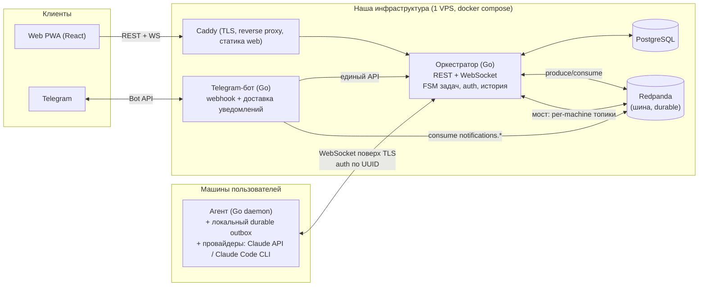

# 01 — Технологический стек и архитектура (MVP)

> Стек верхнего уровня **зафиксирован заказчиком** (бизнес-ТЗ, §7): оркестратор и бот — Go, web — React/PWA, агент — Go/Node.js, БД — PostgreSQL, шина — Redpanda.
> Этот документ доопределяет конкретные библиотеки, топологию и протоколы внутри этих рамок и фиксирует решения, которые ТЗ оставляет на усмотрение архитектора. Решения помечены **[РЕШЕНИЕ]** с обоснованием.

---

## 1. Карта системы

Четыре кодовых компонента. Три деплоятся через GitHub Actions на сервер; агент **собирается** в CI и распространяется как бинарь + install-скрипт (на машины пользователей, не на наш сервер).



### Принцип «единый API»
И web, и Telegram-бот ходят в **один и тот же REST API оркестратора** (логин, постановка/отмена задачи, ответ на вопрос, подтверждение). Бот — это тонкий адаптер канала, а не отдельная бизнес-логика. Новый канал = новый адаптер поверх того же API (FR D1, D4).

---

## 2. Ключевые архитектурные решения

### [РЕШЕНИЕ 1] Агент общается с оркестратором по WebSocket, а не напрямую с Redpanda
ТЗ требует, чтобы **всё** машина ↔ оркестратор шло асинхронно через очередь, с догоном оффлайн-стороны и без потерь (§7, E3). Это требование к **семантике доставки**, а не предписание делать агента Kafka-клиентом. Варианты:

- **A. Агент — прямой клиент Redpanda.** Пришлось бы выставить Redpanda в интернет с TLS+SASL+ACL на каждую машину. Дорого по эксплуатации и риску, ACL-мультитенант в Kafka капризный.
- **B. Агент держит исходящий WebSocket к оркестратору; оркестратор — мост к Redpanda. ✅ выбрано.**

Durability сохраняется на **обоих концах**, поэтому свойство «ничего не теряется» выполняется без прямого доступа агента к шине:
- **Серверная сторона:** Redpanda — долговечный бэкбон. Топик на направление, ключ партиции = `task_id` (порядок в рамках задачи, E §126). Оркестратор коммитит offset исходящего сообщения агенту **только после ACK** от агента (at-least-once + дедуп по message_id).
- **Сторона агента:** локальный durable **outbox** (встроенное хранилище BoltDB/SQLite). Переживает падение оркестратора и перезапуск самого агента; реплеит при реконнекте (покрывает сценарий «оркестратор временно недоступен», Gherkin §9).

WebSocket — это только «живая труба»; надёжность живёт в Redpanda и в локальном outbox. Плюс: Redpanda остаётся приватной внутри инфраструктуры, агент простой (нет Kafka-клиента, нет входящих портов — работает за NAT), auth по UUID делается нашим протоколом.

> Прямой Kafka-доступ агента — кандидат на Фазу 2/3, если появится много агентов и захочется убрать оркестратор из горячего пути. В MVP не нужен.

### [РЕШЕНИЕ 2] Агент пишем на Go (не Node)
ТЗ разрешает Go или Node. Выбираем **Go**:
- Один статический бинарь → «установка одной командой» и автозапуск-демон тривиальны (FR C1, C5), без рантайма на машине пользователя.
- Кросс-компиляция macOS (arm64/amd64) и Ubuntu (amd64/arm64) из CI.
- Один язык для оркестратора, бота и агента → одна компетенция у команды, общий код (модели, протокол).
- Провайдер **Claude Code** — это Node-CLI; его всё равно запускают как **подпроцесс** независимо от языка агента. Node нужен только как зависимость самого Claude Code, и её ставит install-скрипт. Провайдер **Claude** — это просто HTTPS к Anthropic API, тривиально из Go.

### [РЕШЕНИЕ 3] Telegram-бот владеет всем Telegram-I/O
Оркестратор остаётся Telegram-агностиком. Входящие — webhook в боте; исходящие уведомления — бот **консьюмит топик `notifications.telegram`** из Redpanda и шлёт в Bot API. Так токен бота принадлежит ровно одному сервису, а оркестратор лишь публикует событие уведомления с указанием канала. Это и есть «маршрутизация уведомлений» в минимальном виде (G2) и «новый канал без изменения ядра» (D4).

### [РЕШЕНИЕ 4] Монорепозиторий
Один репозиторий со всеми компонентами + общий контракт OpenAPI. Атомарные изменения контракта и клиентов, один CI с path-фильтрами (каждый сервис собирается/деплоится независимо). Для MVP «для себя» это выигрывает у полирепо. Структура — см. §5.

### [РЕШЕНИЕ 5] Хостинг — один VPS + docker compose, деплой GitHub Actions → GHCR → SSH
Дёшево и достаточно для «работает для меня». CI собирает образы, пушит в **GHCR**, по SSH делает `docker compose pull && up` на Ubuntu-VPS. Caddy даёт авто-TLS и раздаёт статику web. Postgres и Redpanda — контейнеры на том же хосте. k8s — оверкилл для MVP (кандидат на потом).

---

## 3. Конкретный стек по компонентам

### Оркестратор (Go)
| Слой | Выбор | Зачем |
|---|---|---|
| Версия | Go 1.23+ | актуальный slog, generics |
| HTTP-роутер | **chi** | лёгкий, на стандартном `net/http`, простые middleware — понятно джунам |
| WebSocket | **coder/websocket** (ex-nhooyr) | контекстный, современный API |
| БД-драйвер | **pgx v5** | быстрый, без `database/sql`-оверхеда |
| Запросы к БД | **sqlc** | пишешь SQL → получаешь типобезопасные Go-функции; идеально для джунов, без магии ORM |
| Миграции | **goose** | простые SQL-миграции, встраиваемые в бинарь |
| Шина | **franz-go (kgo)** | лучший pure-Go Kafka/Redpanda клиент, consumer groups, ручной commit offset |
| JWT | **golang-jwt/jwt v5** | access-токен |
| Пароли | **argon2id** (`x/crypto/argon2`) | современный KDF |
| Валидация | **go-playground/validator** | декларативно |
| Конфиг | **caarlos0/env** | env-переменные, 12-factor |
| Логи | **slog** (stdlib) | структурные, JSON в prod |
| Контракт API | **OpenAPI 3.1** + **oapi-codegen** | генерим серверные интерфейсы и типы из одного contract-файла |
| Тесты | `testing` + **testify** + **testcontainers-go** | поднимаем реальные Postgres+Redpanda в интеграционных тестах |
| BDD | **godog** (Cucumber для Go) | прогоняем Gherkin-сценарии из ТЗ как тесты |

**Auth-модель:** access-токен — короткоживущий JWT (15 мин), refresh-токен — непрозрачный, хранится **хэшом** в БД, поддерживает logout/отзыв (FR A3). Каждый запрос проходит middleware изоляции: `user_id` из токена подставляется во все запросы; на уровне SQL — фильтр по `user_id` + (опц.) Postgres RLS как страховка (FR A4, I3).

### Web (React PWA)
| Слой | Выбор |
|---|---|
| Сборка | **Vite + TypeScript + React 18** |
| PWA | **vite-plugin-pwa** (service worker, installable, оффлайн-оболочка) |
| Серверное состояние | **TanStack Query** |
| Роутинг | **React Router** |
| WS | нативный WebSocket в небольшом хуке (реконнект, бэкофф) |
| UI | **Tailwind CSS + shadcn/ui** (Radix) |
| Формы | **react-hook-form + zod** |
| Типы API | **openapi-typescript** из общего contract (web всегда в синхроне с Go) |
| Тесты | **Vitest + React Testing Library**, **Playwright** (E2E ключевых флоу) |

> Web push в MVP вне объёма (§9). Уведомления в web — только по WebSocket при открытой вкладке (G1).

### Telegram-бот (Go)
| Слой | Выбор |
|---|---|
| Библиотека | **telebot v3** (tucnak/telebot) — дружелюбна к джунам |
| Режим | **webhook** (HTTPS-эндпоинт за Caddy) |
| Привязка аккаунта | deep-link `/start <one-time-code>` — код генерит web, бот обменивает его в оркестраторе на привязку (FR D3) |
| Уведомления | consumer Redpanda `notifications.telegram` → Bot API |

### Агент (Go-демон)
| Слой | Выбор |
|---|---|
| Транспорт | **coder/websocket** к оркестратору, авто-реконнект |
| Локальный outbox/состояние | **bbolt (BoltDB)** — встроенный, без внешних зависимостей |
| Провайдер Claude | HTTPS к Anthropic API |
| Провайдер Claude Code | подпроцесс `claude` CLI, управление stdio, перехват запросов на согласование команд (allowlist) |
| Демонизация | **launchd** (macOS) / **systemd** (Ubuntu), автозапуск + рестарт при сбое (FR C5) |
| Креды провайдера | хранятся локально (файл с правами 600 / keychain), в оркестратор не уходят (FR C4, J1) |
| Сборка/релиз | **GoReleaser** → бинарь в GitHub Releases; `install.sh` его выкачивает |

### Инфраструктура / DevOps
| Слой | Выбор |
|---|---|
| Реестр образов | **GHCR** (ghcr.io) |
| Оркестрация на хосте | **docker compose** на Ubuntu-VPS |
| Reverse proxy / TLS | **Caddy** (авто-Let's Encrypt), раздаёт и статику web |
| CI/CD | **GitHub Actions** (path-фильтры на сервис) |
| Релиз агента | **GoReleaser** + GitHub Releases |
| Секреты сборки | GitHub Actions Secrets + Environments (prod с required reviewer) |
| Секреты рантайма | `.env` на хосте (на Фазе 2 — sops/age) |
| Бэкап БД | `pg_dump` по cron (история хранится бессрочно, I2) |

---

## 4. Сквозные технические требования (закладываем с первого дня)

1. **Идемпотентность и дедуп.**
   - Постановка задачи: клиент шлёт `Idempotency-Key`; оркестратор гарантирует уникальность (E7, Gherkin §4 «защита от двойной отправки»).
   - Сообщения в шине: у каждого `message_id` (UUID); применение идемпотентно; порядок в рамках задачи — через ключ партиции `task_id`.
   - Агент шлёт ACK; доставка at-least-once + идемпотентное применение на приёмнике.
2. **Конечный автомат задачи** (см. `Жизненный цикл задачи.md`) — реализуется явной таблицей разрешённых переходов + функцией перехода, каждый переход персистится и порождает событие/уведомление. Недопустимые переходы отвергаются.
3. **Шифрование чувствительных данных at-rest** (I1): тексты запросов/ответов и UUID интеграций — app-level AEAD (ключ из секретов) либо `pgcrypto`. UUID хранится в виде, пригодном и для аутентификации (HMAC-сверка), и для показа пользователю (он нужен ему для настройки машины, B2).
4. **Аудит** (F4): единый журнал событий задачи (вопросы агента, ответы и решения пользователя, согласования команд) — пишется с первого дня, даже до полноценного аудит-журнала Фазы 2.
5. **Автотесты на весь функционал** (ТЗ §127): юнит + интеграционные на testcontainers + Gherkin-сценарии через godog (Go) и Playwright (web). Это критерий готовности, а не «по остаточному принципу».
6. **Статус машины** (B4): heartbeat агента через ту же шину; оркестратор переводит интеграцию в `offline` по таймауту отсутствия heartbeat. Без живого синхронного соединения (Gherkin §2).

---

## 5. Структура монорепозитория

```
/orchestrator        # Go: REST+WS, FSM, auth, БД, мост к Redpanda
  /internal/...
  /migrations         # goose
  /queries            # sqlc .sql
  Dockerfile
/bot                 # Go: Telegram-адаптер
  Dockerfile
/agent               # Go: демон на машину пользователя (GoReleaser, не в compose)
/web                 # React PWA (Vite)
  Dockerfile          # multi-stage → статика, которую раздаёт Caddy
/api                 # openapi.yaml (источник правды) + сгенерированные клиенты
/deploy
  docker-compose.yml
  Caddyfile
  /scripts            # deploy.sh (ssh), bootstrap
/install             # install.sh (одна команда для пользователя)
/docs                # эти документы, ADR
.github/workflows    # ci.yml, deploy.yml (path-фильтры), release-agent.yml
Makefile             # generate, lint, test, run-local
```

---

## 6. Топики Redpanda (MVP)

| Топик | Направление | Ключ партиции | Назначение |
|---|---|---|---|
| `machine.commands.<нет, см. ниже>` | оркестратор → агент | `task_id` | постановка/отмена задачи, ответы пользователя, согласования |
| `machine.events` | агент → оркестратор | `task_id` | прогресс, вопросы агента, «завершил», ошибки, heartbeat |
| `notifications.telegram` | оркестратор → бот | `user_id` | уведомления для доставки в Telegram |

> Для адресации команд конкретной машине оркестратор-мост держит per-machine логическую подписку; физически это может быть один топик `machine.commands` с ключом по `integration_id` + фильтрация на стороне моста при пуше в нужный WebSocket. Точную раскладку партиций/топиков фиксируем в первой задаче EPIC 3 (ADR).

---

## 7. Что осознанно НЕ делаем в MVP (из §9 ТЗ)
Несколько провайдеров сверх Claude/Claude Code; несколько агентов на машине; роли/команды/общий доступ; песочница и политики поверх allowlist; MFA, восстановление пароля, web push, email; ротация/отзыв токена регистрации и UUID; удаление пользователем своих данных. Архитектуру держим открытой для этого (D4, явные швы), но код не пишем.
